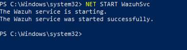
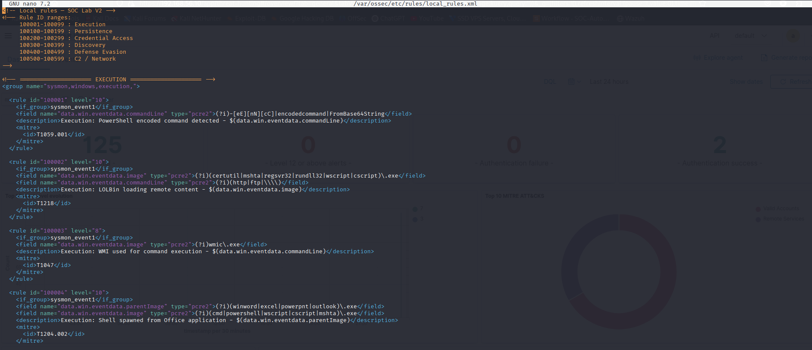
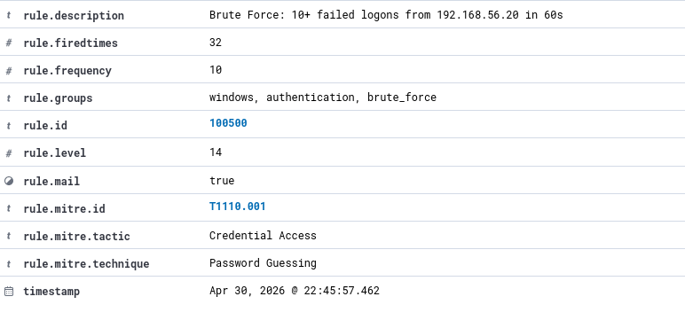
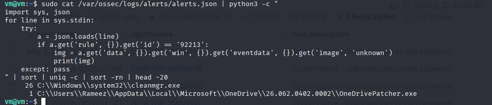
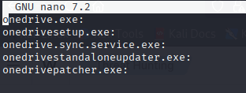
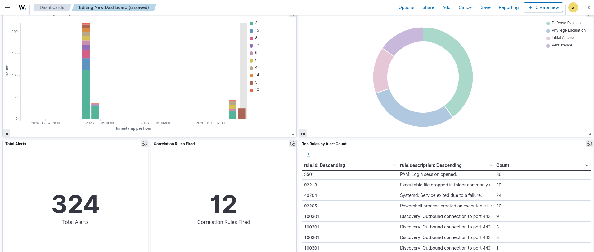
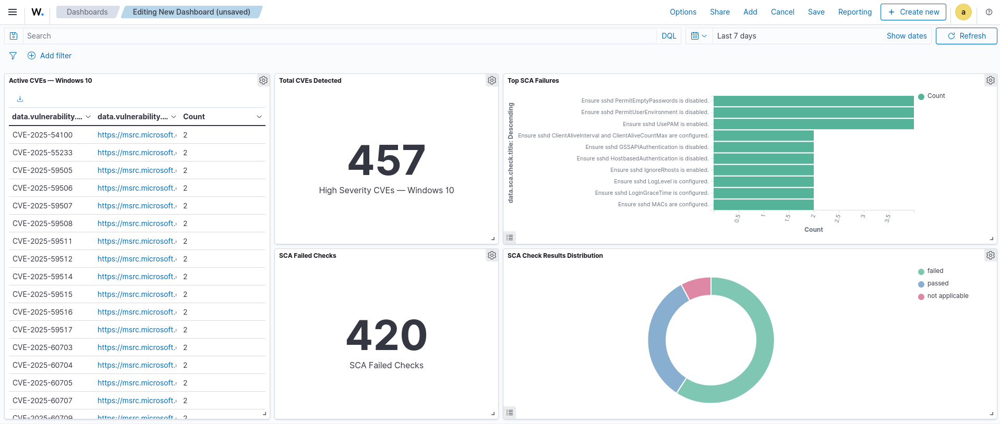

# Wazuh SOAR SOC Lab

Đây là dự án xây dựng Trung tâm Điều hành An ninh mạng (SOC) thực hành trên VirtualBox. Lab mô phỏng toàn bộ quy trình từ thu thập log, xây dựng luật phát hiện, tương quan sự kiện, giảm cảnh báo giả và trực quan hóa dữ liệu đến tự động hóa phản ứng sự cố bằng SOAR.

> Dự án phục vụ mục đích học tập và thử nghiệm trong môi trường cô lập. Không thực hiện các kịch bản tấn công trên hệ thống khi chưa được cho phép.

---

## Kiến trúc hệ thống

```text
Máy chủ vật lý: Windows 11 (MSI) + VirtualBox
│
├── Ubuntu 24.04 (192.168.56.10, 15 GB RAM)
│   ├── Wazuh Manager, Indexer và Dashboard
│   ├── Shuffle SOAR
│   ├── TheHive
│   └── Cortex
│
├── Kali Linux (192.168.56.20, 6 GB RAM)
│   └── Máy tấn công và máy trạm của chuyên viên phân tích
│
├── Windows 10 VM (192.168.56.30, 4 GB RAM)
│   └── Máy nạn nhân: Wazuh Agent + Sysmon
│
└── Windows 11 MSI (192.168.0.25)
    └── Máy nạn nhân vật lý: Wazuh Agent + Sysmon

Mạng Host-Only: 192.168.56.0/24
Windows 11 vật lý kết nối tới máy chủ qua Bridged Adapter.
```

| Máy | Vai trò | Địa chỉ IP | RAM | Kết nối |
|---|---|---:|---:|---|
| Ubuntu 24.04 VM | Máy chủ Wazuh, Shuffle, TheHive và Cortex | `192.168.56.10` | 15 GB | Host-Only + Bridged |
| Kali Linux VM | Máy tấn công / máy trạm phân tích | `192.168.56.20` | 6 GB | Host-Only |
| Windows 10 VM | Endpoint nạn nhân thứ nhất | `192.168.56.30` | 4 GB | Host-Only |
| Windows 11 MSI | Endpoint nạn nhân thứ hai | `192.168.0.25` | — | Mạng vật lý / Bridged |

---

## Các giai đoạn của dự án

| Giai đoạn | Nội dung | Tài liệu |
|---|---|---|
| 1. Hạ tầng | Triển khai Wazuh all-in-one, agent, Sysmon và các kênh log | [phase1-setup.md](docx/phase1-setup.md) |
| 2. Chuẩn hóa và phát hiện | Xây dựng 12 luật phát hiện tùy chỉnh, ánh xạ MITRE ATT&CK | [phase2-normalisation.md](docx/phase2-normalisation.md) |
| 3. Tương quan | Phát hiện brute force, chuỗi trinh sát và chuỗi duy trì truy cập | [phase3-correlation.md](docx/phase3-correlation.md) |
| 4. Tổng hợp và tinh chỉnh | Điều tra cảnh báo giả, giảm nhiễu có chọn lọc | [phase4-aggregation.md](docx/phase4-aggregation.md) |
| 5. Báo cáo | Xây dựng dashboard tổng quan tấn công và trạng thái an ninh | [phase5-reporting.md](docx/phase5-reporting.md) |
| 6. SOAR | Tự động hóa luồng Wazuh → Shuffle → TheHive, làm giàu bằng Cortex | [phase6-soar.md](docx/phase6-soar.md) |

---

## Giai đoạn 1 — Xây dựng hạ tầng

Lab sử dụng Ubuntu 24.04 làm máy chủ trung tâm, chạy Wazuh 4.14.5 theo mô hình all-in-one gồm Manager, Indexer và Dashboard. Kali Linux được dùng để mô phỏng hoạt động tấn công và truy cập giao diện quản trị tại `https://192.168.56.10`.

Windows 10 VM và máy Windows 11 vật lý được cài Wazuh Agent cùng Sysmon. Các endpoint gửi Security, System, Application và Sysmon/Operational log về Wazuh Manager. Sysmon cung cấp dữ liệu chi tiết về tiến trình, dòng lệnh, kết nối mạng, thay đổi Registry và các hành vi trên tệp mà Windows Event Log tiêu chuẩn không thể hiện đầy đủ.




Xem hướng dẫn triển khai tại [Giai đoạn 1 — Thiết lập hạ tầng](docx/phase1-setup.md).

---

## Giai đoạn 2 — Chuẩn hóa và xây dựng luật phát hiện

Mỗi log gửi về Wazuh được xử lý qua hai lớp:

1. **Decoder** phân tích log thô và trích xuất các trường có cấu trúc, chẳng hạn `win.eventdata.image` và `win.eventdata.commandLine`.
2. **Rules engine** đối chiếu các trường đã giải mã với luật và tạo cảnh báo khi điều kiện khớp.

Các luật tùy chỉnh được lưu tại `/var/ossec/etc/rules/local_rules.xml` trên Wazuh Manager. Bản cấu hình của dự án nằm trong [config/wazuh/local_rules.xml](config/wazuh/local_rules.xml).

> Trên Dashboard, tên trường thường có tiền tố `data.` (ví dụ `data.win.eventdata.image`), nhưng trong luật XML phải dùng tên trường không có tiền tố này (`win.eventdata.image`). Dùng sai tên trường có thể khiến luật được nạp nhưng không bao giờ kích hoạt.

### Các luật phát hiện tùy chỉnh

| Rule ID | Nhóm hành vi | Phát hiện | MITRE ATT&CK |
|---:|---|---|---|
| 100001 | Thực thi | Lệnh PowerShell được mã hóa | T1059.001 |
| 100002 | Thực thi | LOLBin tải nội dung từ xa | T1218 |
| 100003 | Thực thi | Thực thi lệnh bằng WMI | T1047 |
| 100004 | Thực thi | Ứng dụng Office tạo tiến trình shell | T1204.002 |
| 100100 | Duy trì truy cập | Thay đổi `ImagePath` của Windows service | T1031, T1050 |
| 100101 | Duy trì truy cập | Thay đổi Registry Run key | T1547.001 |
| 100102 | Duy trì truy cập | Tạo Scheduled Task bằng `schtasks.exe` | T1053.005 |
| 100200 | Truy cập thông tin xác thực | Tiến trình truy cập LSASS | T1003.001 |
| 100300 | Khám phá | Thực thi các lệnh trinh sát hệ thống | T1082, T1033 |
| 100301 | Khám phá mạng | Kết nối ra ngoài tới các cổng cần giám sát | T1046 |
| 100400 | Né tránh phòng thủ | Tiêm tiến trình bằng CreateRemoteThread | T1055 |
| 100401 | Né tránh phòng thủ | PowerShell sử dụng các cờ né tránh | T1059.001 |




Xem cách viết, kiểm thử và ánh xạ luật tại [Giai đoạn 2 — Chuẩn hóa](docx/phase2-normalisation.md).

---

## Giai đoạn 3 — Tương quan sự kiện

Luật ở giai đoạn 2 phát hiện từng sự kiện riêng lẻ. Giai đoạn 3 sử dụng luật theo tần suất để phát hiện một chuỗi hành vi: nhiều sự kiện có vẻ bình thường khi đứng riêng nhưng tạo thành dấu hiệu tấn công khi xuất hiện liên tiếp.

Các thành phần XML chính gồm:

- `frequency` và `timeframe`: số lần khớp trong một khoảng thời gian;
- `if_matched_sid`: tương quan từ một rule cụ thể;
- `if_matched_group`: tương quan từ các rule thuộc cùng nhóm;
- `same_field`: chỉ đếm sự kiện của cùng nguồn, người dùng hoặc thực thể.

| Rule ID | Level | Phát hiện | MITRE ATT&CK |
|---:|---:|---|---|
| 100500 | 14 | Từ 10 lần đăng nhập thất bại của cùng IP trong 60 giây | T1110.001 |
| 100600 | 12 | Từ 3 lệnh trinh sát của cùng người dùng trong 60 giây | T1082, T1033 |
| 100601 | 14 | Từ 2 kỹ thuật duy trì truy cập của cùng người dùng trong 120 giây | T1053.005, T1547.001 |

```text
Brute force  → Kali/Metasploit → Windows 10:445       → Rule 100500, level 14
Trinh sát    → whoami, ipconfig, net, systeminfo      → Rule 100600, level 12
Duy trì      → schtasks /create + Registry Run key    → Rule 100601, level 14
```





Xem kịch bản kiểm thử đầy đủ tại [Giai đoạn 3 — Tương quan](docx/phase3-correlation.md).

---

## Giai đoạn 4 — Giảm nhiễu và cảnh báo giả

Mục tiêu của giai đoạn này là giảm khối lượng cảnh báo để chuyên viên tập trung vào sự kiện có thể hành động. Quy trình gồm xác định các rule tạo nhiều cảnh báo, kiểm tra nguyên nhân thực tế rồi chỉ loại bỏ hành vi đã được xác minh là hợp lệ.

Phát hiện nổi bật là rule 92213 tạo 112 cảnh báo mức 15 khi `cleanmgr.exe` giải nén DLL vào thư mục Temp. Đây là hành vi bình thường của Windows Disk Cleanup nhưng có thể gây mệt mỏi cảnh báo và làm giảm giá trị của mức Critical.

Các rule suppression sử dụng `level="0"` và `<options>no_log</options>`:

| Rule ID | Nội dung được loại khỏi cảnh báo |
|---:|---|
| 100700 | `cleanmgr.exe` hoặc `OneDrivePatcher.exe` tạo tệp trong Temp |
| 100701 | Sự kiện cài đặt gói `dpkg` trên Ubuntu |
| 100702 | Sự kiện `dpkg` ở trạng thái half-configured |
| 100703 | Hoạt động DLL hợp lệ của `svchost.exe` trong thư mục Windows |
| 100704 | Kết nối ra ngoài hợp lệ của OneDrive |
| 100705 | Lệnh khám phá do tài khoản `SYSTEM` thực thi hợp lệ |
| 100706 | PowerShell có cờ né tránh nhưng được khởi tạo bởi tiến trình hệ thống tin cậy |





Chi tiết phương pháp điều tra và kiểm thử suppression nằm tại [Giai đoạn 4 — Tổng hợp và tinh chỉnh](docx/phase4-aggregation.md).

---

## Giai đoạn 5 — Dashboard và báo cáo

Hai dashboard được xây dựng trong OpenSearch Dashboards:

- **Attack Overview**: dòng thời gian cảnh báo theo mức độ, phân bố MITRE tactic, tổng số cảnh báo, số lần kích hoạt rule tương quan và các rule xuất hiện nhiều nhất.
- **Security Posture**: CVE đang hoạt động trên Windows 10, số lượng lỗ hổng, các kiểm tra SCA thất bại và tỷ lệ đạt/không đạt tuân thủ.

Trong khoảng thời gian được chọn khi thực hiện lab, dữ liệu ghi nhận 324 cảnh báo, 12 cảnh báo tương quan, 457 cảnh báo CVE mức cao và 420 kiểm tra SCA không đạt. Các con số phụ thuộc vào time range và dữ liệu hiện có trong OpenSearch, vì vậy có thể thay đổi khi lab tiếp tục hoạt động.





Xem cấu hình panel và DQL filter tại [Giai đoạn 5 — Báo cáo](docx/phase5-reporting.md).

---

## Giai đoạn 6 — Tự động hóa SOAR

Pipeline SOAR chuyển các cảnh báo có giá trị từ Wazuh sang TheHive để chuyên viên phân tích xử lý, đồng thời sử dụng Cortex để làm giàu observable bằng dữ liệu tình báo mối đe dọa.

```text
Endpoint phát sinh hành vi
        ↓
Wazuh Agent + Sysmon thu thập sự kiện
        ↓
Wazuh phát hiện và gửi webhook
        ↓
Shuffle lọc, ánh xạ mức độ và bổ sung ngữ cảnh
        ↓
TheHive tạo alert để chuyên viên phân loại
        ↓
Alert được chuyển thành case và thêm observable
        ↓
Cortex chạy VirusTotal / Abuse_Finder analyzer
```

Shuffle bỏ qua alert có severity nhỏ hơn 2, sau đó ánh xạ severity của payload Wazuh sang TheHive:

| Wazuh severity | Khoảng Wazuh rule level | TheHive severity | Mức độ |
|---:|---:|---:|---|
| 0 | 0–3 | 1 | Low |
| 1 | 4–7 | 2 | Medium |
| 2 | 8–11 | 3 | High |
| 3 | 12–15 | 4 | Critical |

Mã tạo nội dung alert và JSON body dùng trong Shuffle được lưu tại:

- [config/shuffle/build_alert.py](config/shuffle/build_alert.py)
- [config/shuffle/thehive_alert_body.json](config/shuffle/thehive_alert_body.json)


Xem hướng dẫn triển khai và kiểm thử end-to-end tại [Giai đoạn 6 — SOAR](docx/phase6-soar.md).

---

## Truy cập các dịch vụ

Khi các máy và dịch vụ đã được khởi động theo tài liệu từng giai đoạn:

| Dịch vụ | Địa chỉ |
|---|---|
| Wazuh Dashboard | `https://192.168.56.10` |
| Shuffle | `http://192.168.56.10:3001` |
| TheHive | `http://192.168.56.10:9000` |
| Cortex | `http://192.168.56.10:9001` |

Repo hiện lưu tài liệu và các tệp cấu hình cần thiết; chưa có script tự động khởi động hoặc dừng toàn bộ lab. Hãy bắt đầu với [docx/phase1-setup.md](docx/phase1-setup.md), sau đó thực hiện lần lượt các giai đoạn.

---

## Công nghệ sử dụng

| Công nghệ | Phiên bản trong lab | Vai trò |
|---|---|---|
| Wazuh | 4.14.5 | SIEM, phát hiện, tương quan và cảnh báo |
| Sysmon | Bản cài trong lab | Thu thập telemetry chuyên sâu trên Windows |
| SwiftOnSecurity Sysmon Config | Bản dùng khi triển khai | Cấu hình thu thập Sysmon |
| Shuffle | Bản dùng khi triển khai | Điều phối và tự động hóa SOAR |
| TheHive | 5.2.x | Quản lý alert, case và quy trình phân tích |
| Cortex | 3.1.x | Làm giàu observable |
| VirtualBox | 7.x | Nền tảng ảo hóa |
| Ubuntu | 24.04 LTS | Hệ điều hành máy chủ |
| Kali Linux | Bản dùng trong lab | Mô phỏng tấn công và phân tích |
| Windows 10 / 11 | Pro / Home | Endpoint giám sát |

---

## Cấu trúc repository

```text
Wazuh-SOAR-SOC-LAB/
├── assets/                  # Ảnh minh họa và bằng chứng kiểm thử
├── config/
│   ├── shuffle/             # Python và JSON tạo alert TheHive
│   └── wazuh/               # Bộ luật Wazuh tùy chỉnh
├── docx/                    # Tài liệu chi tiết cho sáu giai đoạn
└── README.md                # Tổng quan dự án
```

## Tài liệu tham khảo

- [Wazuh Documentation](https://documentation.wazuh.com/) — tài liệu chính thức của Wazuh
- [MITRE ATT&CK](https://attack.mitre.org/) — khung kỹ thuật dùng để ánh xạ luật phát hiện
- [Sigma Rules](https://github.com/SigmaHQ/sigma) — nguồn tham khảo khi xây dựng logic phát hiện
- [SwiftOnSecurity Sysmon Config](https://github.com/SwiftOnSecurity/sysmon-config) — cấu hình Sysmon tham khảo
