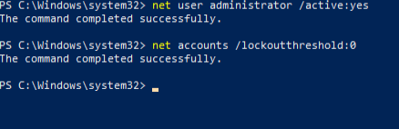
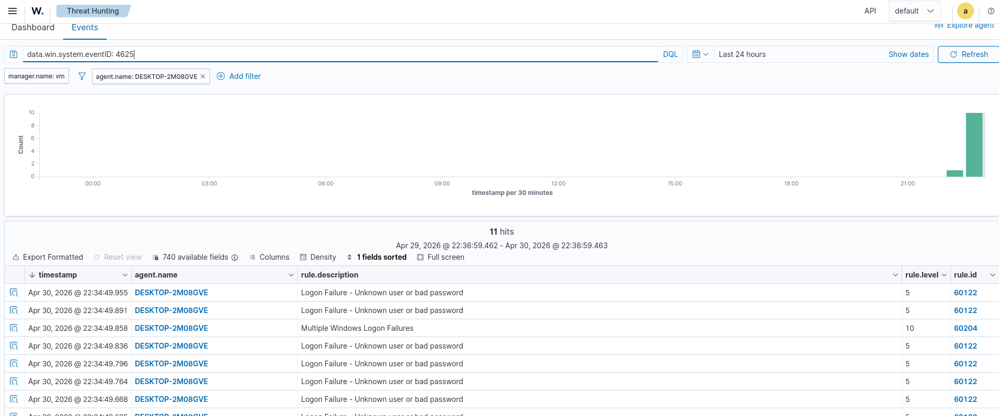
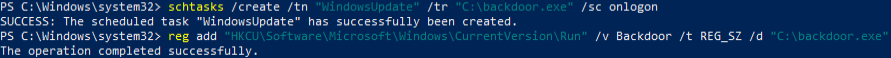
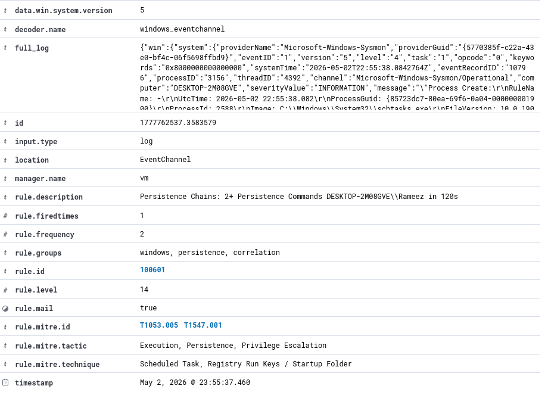

# Phase 3 — Correlation

## Tổng quan

Phase 2 đã viết các rule kích hoạt trên từng event riêng lẻ. Phase 3 viết các rule kích hoạt trên **pattern của events** — các sequence, burst và chain trông có vẻ vô hại khi đứng riêng lẻ nhưng khi kết hợp lại thì báo hiệu một attack đang diễn ra.

---

## Cách Correlation hoạt động trong Wazuh

Các frequency-based rule của Wazuh nằm trên những rule hiện có và đếm số lần một parent rule được kích hoạt trong một time window.

```
Event riêng lẻ kích hoạt rule 100300 (level 6)
Event riêng lẻ kích hoạt rule 100300 (level 6)
Event riêng lẻ kích hoạt rule 100300 (level 6)  ← Lần khớp thứ 3 trong 60 giây
        │
        ▼
Correlation rule 100600 kích hoạt (level 12) → "Recon chain detected"
```

### Các thành phần chính

| Element | Mục đích |
|---|---|
| `frequency` | Số lần parent rule phải khớp trước khi correlation được kích hoạt |
| `timeframe` | Time window tính bằng giây — tất cả lần khớp phải nằm trong khoảng này |
| `if_matched_sid` | Tạo chain từ một **rule ID cụ thể** — đếm số lần khớp của riêng rule đó |
| `if_matched_group` | Tạo chain từ **bất kỳ rule nào trong một group được đặt tên** — ghi nhận mọi tổ hợp technique |
| `same_field` | Nhóm các lần khớp theo một field value — đảm bảo chúng đến từ cùng một attacker/user |

### `if_matched_sid` và `if_matched_group`

Sử dụng `if_matched_sid` khi bạn muốn phát hiện việc lặp lại một technique cụ thể (ví dụ: nhiều lần failed logon → brute force).

Sử dụng `if_matched_group` khi bạn muốn phát hiện bất kỳ tổ hợp technique nào trong một category (ví dụ: scheduled task + registry run key = persistence chain).

---

## Cấu trúc của Correlation Rule

```xml
<rule id="100600" level="12" frequency="3" timeframe="60">
    <if_matched_sid>100300</if_matched_sid>
    <same_field>win.eventdata.user</same_field>
    <description>Recon Chain: 3+ discovery commands by $(win.eventdata.user) in 60s</description>
    <mitre><id>T1082</id><id>T1033</id></mitre>
</rule>
```

| Component | Giải thích |
|---|---|
| `frequency="3" timeframe="60"` | Kích hoạt khi parent rule khớp 3 lần trong vòng 60 giây |
| `if_matched_sid>100300` | Parent là rule 100300 — recon command riêng lẻ |
| `same_field>win.eventdata.user` | Cả 3 lần khớp phải đến từ cùng một Windows user account |
| `$(win.eventdata.user)` | Chèn giá trị user thực tế vào phần mô tả alert |

---

## Rule ID Namespace

```
100500 - 100599  →  Lateral Movement / Brute Force
100600 - 100699  →  Correlation Chains (multi-event)
```

---

## Các Attack Chain đã xây dựng

### Chain 1 — Brute Force (rule 100500)

**Attack:** Attacker tấn công liên tục vào SMB từ Kali bằng một password list, tạo ra hàng loạt failed logon attempt (Windows Event ID 4625).

**Cách phát hiện:** Wazuh built-in rule 60122 kích hoạt trên từng logon failure riêng lẻ. Rule 100500 đếm từ 10 lần khớp trở lên từ cùng một source IP trong vòng 60 giây và nâng mức lên level 14.

```xml
<rule id="100500" level="14" frequency="10" timeframe="60">
  <if_matched_sid>60122</if_matched_sid>
  <same_field>win.eventdata.ipAddress</same_field>
  <description>Brute Force: 10+ failed logons from $(win.eventdata.ipAddress) in 60s</description>
  <mitre><id>T1110.001</id></mitre>
</rule>
```

**Lý do sử dụng `same_field` trên `ipAddress`:** Nhóm các failure theo attacker IP. Nếu không có cấu hình này, failure từ nhiều source sẽ được gộp lại, tạo ra false positive.

**MITRE:** T1110.001 — Password Guessing

---

### Chain 2 — Recon Chain (rule 100600)

**Attack:** Sau khi giành được quyền truy cập, attacker chạy một loạt discovery command để tìm hiểu environment: `whoami`, `ipconfig`, `net user`, `systeminfo`, `tasklist`.

**Cách phát hiện:** Rule 100300 kích hoạt trên từng recon command riêng lẻ (level 6). Rule 100600 đếm từ 3 lần khớp trở lên từ cùng một user trong vòng 60 giây và nâng mức lên level 12.

```xml
<rule id="100600" level="12" frequency="3" timeframe="60">
  <if_matched_sid>100300</if_matched_sid>
  <same_field>win.eventdata.user</same_field>
  <description>Reconnaissance Chains: 3+ Discovery Commands $(win.eventdata.user) in 60s</description>
  <mitre><id>T1082</id><id>T1033</id></mitre>
</rule>
```

**Lý do sử dụng `same_field` trên `user`:** Nhóm theo Windows account chạy các command. Attacker đã compromise account `Rameez` sẽ thực hiện toàn bộ hoạt động recon dưới identity đó — `same_field` đảm bảo chain chỉ kích hoạt khi cùng một account thực hiện burst này.

**MITRE:** T1082 (System Information Discovery), T1033 (System Owner/User Discovery)

---

### Chain 3 — Persistence Chain (rule 100601)

**Attack:** Attacker thiết lập nhiều persistence mechanism để duy trì quyền truy cập sau khi reboot — một scheduled task và một registry Run key, cả hai đều được tạo trong một khoảng thời gian ngắn.

**Cách phát hiện:** Các rule 100100, 100101 và 100102 lần lượt kích hoạt trên từng persistence event riêng lẻ (level 10–12). Rule 100601 sử dụng `if_matched_group` để ghi nhận bất kỳ tổ hợp persistence technique nào — từ 2 lần khớp trở lên từ cùng một user trong vòng 120 giây sẽ kích hoạt correlation ở level 14.

```xml
<rule id="100601" level="14" frequency="2" timeframe="120">
  <if_matched_group>persistence</if_matched_group>
  <same_field>win.eventdata.user</same_field>
  <description>Persistence Chains: 2+ Persistence Commands $(win.eventdata.user) in 120s</description>
  <mitre><id>T1053.005</id><id>T1547.001</id></mitre>
</rule>
```

**Lý do sử dụng `if_matched_group` thay cho `if_matched_sid`:** Có ba persistence rule khác nhau (service modification, Run key, scheduled task). `if_matched_group` ghi nhận bất kỳ hai rule nào trong số đó — attacker sử dụng technique nào không quan trọng, chain sẽ kích hoạt dựa trên pattern.

**MITRE:** T1053.005 (Scheduled Task), T1547.001 (Registry Run Keys)

---

## Kiểm thử Full Kill Chain

Cả ba chain đã được kiểm thử end-to-end trong một session duy nhất, mô phỏng quá trình phát triển của một attack thực tế:

```
1. Brute Force      Kali → Metasploit smb_login → Windows 10:445
2. Recon            Windows 10 → whoami, ipconfig, net user, systeminfo, tasklist
3. Persistence      Windows 10 → schtasks /create + reg add Run key
```

### Bước 1 — Thiết lập Brute Force

Administrator account được mở khóa và lockout policy bị vô hiệu hóa trước attack:

```cmd
net user administrator /active:yes
net accounts /lockoutthreshold:0
```

**Mở khóa attacker account**


**Metasploit SMB brute force đang chạy**


**Metasploit tạo các failed logon attempt**


**Các event 4625 được truyền vào Wazuh**


**XML của Rule 100500**


**Chạy lại attack sau khi mở khóa account**


**Rule 100500 kích hoạt — level 14, T1110.001, 32 lần**


---

### Bước 2 — Recon Chain

**Rule 100600 kích hoạt — level 12, T1082 + T1033, kích hoạt hai lần trong session**


---

### Bước 3 — Persistence Chain

**Các persistence command được chạy trên Windows 10**


**Rule 100601 kích hoạt — level 14, T1053.005 + T1547.001**


---

## Tổng hợp Correlation Rules

| Rule | Level | Phát hiện | Tạo chain từ | MITRE |
|---|---|---|---|---|
| 100500 | 14 | 10+ failed logon từ cùng một IP trong 60 giây | Rule 60122 (logon failure) | T1110.001 |
| 100600 | 12 | 3+ recon command bởi cùng một user trong 60 giây | Rule 100300 (recon command) | T1082, T1033 |
| 100601 | 14 | 2+ persistence technique bởi cùng một user trong 120 giây | Group: persistence | T1053.005, T1547.001 |

---

## Các bài học chính

### Individual alert và correlation alert

Individual alert cho bạn biết điều gì đã xảy ra. Correlation alert cho bạn biết có điều gì đó không ổn. Một lệnh `whoami` đơn lẻ là info event ở level 6. Ba command `whoami` + `ipconfig` + `net user` trong 30 giây từ cùng một account là incident ở level 12.

### Parent alert chứa thông tin chi tiết

Correlation alert kích hoạt một lần và thông báo "recon burst detected". Các individual parent alert bên dưới hiển thị chính xác những command nào đã chạy và theo thứ tự nào. Luôn xem xét cả hai khi investigation.

### `same_field` ngăn false positive

Nếu không có `same_field`, frequency rule sẽ gộp event từ tất cả source. Một environment bận rộn sẽ liên tục kích hoạt brute force alert chỉ từ những failed logon thông thường trên nhiều user và machine khác nhau. `same_field` giới hạn phạm vi đếm vào một attacker, một account, một session.

---

## Các Command hữu ích

```bash
# Restart manager after rule changes
sudo systemctl restart wazuh-manager

# Check rules loaded without errors
sudo grep -i "error\|warning" /var/ossec/logs/ossec.log | grep "1006"

# View recent correlation alerts
sudo tail -100 /var/ossec/logs/alerts/alerts.log | grep -E "100500|100600|100601"

# Test a rule against a raw log
sudo /var/ossec/bin/wazuh-logtest
```
