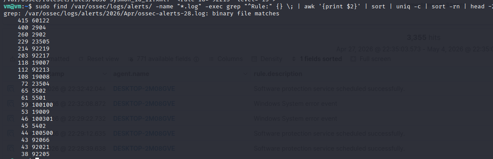
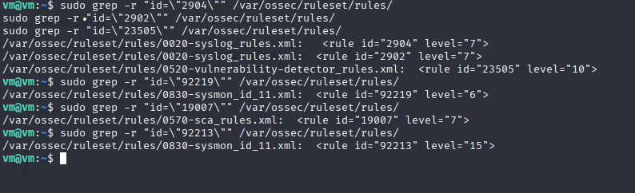
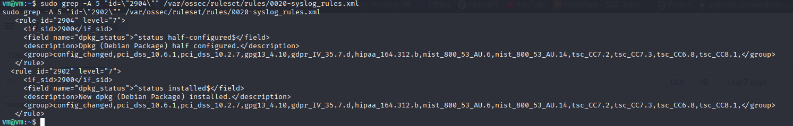
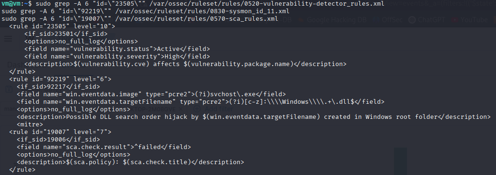
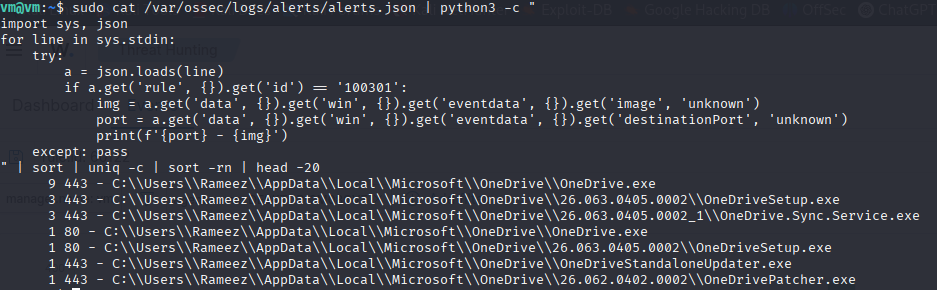
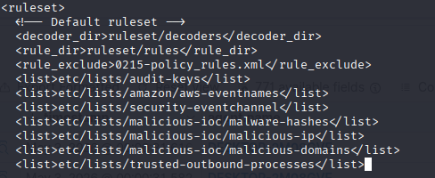

# Phase 4 — Aggregation

## Tổng quan

Aggregation là quá trình giảm alert volume để analyst chỉ nhìn thấy những thông tin có thể xử lý. Trong một SOC thực tế, alert fatigue là một trong những nguyên nhân hàng đầu khiến detection bị bỏ sót — analyst sẽ ngừng theo dõi một dashboard tạo ra hàng trăm alert chất lượng thấp mỗi ngày.

Phase 4 giải quyết vấn đề này bằng cách:
1. **Xác định** những rule nào kích hoạt thường xuyên nhất và lý do
2. **Suppress** các hoạt động known-good tạo ra false positive
3. **Duy trì** detection thực bằng cách suppression có chọn lọc, không áp dụng blanket

---

## Methodology

### Bước 1 — Xác định noise

Query tất cả alert log file và xếp hạng rule theo số lần kích hoạt:

```bash
sudo find /var/ossec/logs/alerts/ -name "*.log" -exec grep "^Rule:" {} \; | awk '{print $2}' | sort | uniq -c | sort -rn | head -20
```

Command này tìm kiếm mọi archived log file, không chỉ file hiện tại. Tổng số trong 7 ngày cho thấy bức tranh noise thực sự:

| Số lượng | Rule | Mô tả |
|---|---|---|
| 415 | 60122 | Logon failure — dự kiến từ các brute force simulation |
| 400 | 2904 | Dpkg package half-configured (Ubuntu) |
| 260 | 2902 | Dpkg package installed (Ubuntu) |
| 229 | 23505 | Phát hiện high severity CVE (vulnerability scanner) |
| 214 | 92219 | Hoạt động DLL của svchost.exe trong Windows root |
| 118 | 19007 | SCA compliance check thất bại |
| 112 | 92213 | Executable được thả vào thư mục Temp — **level 15** |
| 46 | 100301 | Outbound connection đến attack port (rule của chúng ta) |

**Kết quả đếm đầy đủ các rule trên tất cả log**


**Xác định từng noisy rule**


**Rule 2902 và 2904 — event của dpkg package manager**


**Rule 23505, 92219, 19007 — vulnerability scanner, Sysmon, SCA**


### Bước 2 — Investigation trước khi suppression

Không phải mọi rule có volume cao đều là noise. Trước khi suppression, hãy xác định chính xác yếu tố nào đang kích hoạt rule:

```bash
# Find which processes triggered a specific rule
sudo cat /var/ossec/logs/alerts/alerts.json | python3 -c "
import sys, json
for line in sys.stdin:
    try:
        a = json.loads(line)
        if a.get('rule', {}).get('id') == 'RULE_ID':
            img = a.get('data', {}).get('win', {}).get('eventdata', {}).get('image', 'unknown')
            print(img)
    except: pass
" | sort | uniq -c | sort -rn | head -20
```

---

## Phát hiện chính — Alert Fatigue do Level 15 False Positive

**Rule 92213** — "Executable file dropped in folder commonly used by malware" — đã kích hoạt **112 lần** ở **level 15 (critical)** trong suốt vòng đời của lab.

Investigation cho thấy tất cả các lần khớp đều đến từ `C:\Windows\system32\cleanmgr.exe` — Windows Disk Cleanup. Khi Disk Cleanup chạy, nó giải nén hơn 20 DLL file vào một temp folder, mỗi file lại kích hoạt một level 15 critical alert riêng biệt.

```
cleanmgr.exe → AppData\Local\Temp\{GUID}\WimProvider.dll        → rule 92213 [level 15]
cleanmgr.exe → AppData\Local\Temp\{GUID}\VhdProvider.dll        → rule 92213 [level 15]
cleanmgr.exe → AppData\Local\Temp\{GUID}\UnattendProvider.dll   → rule 92213 [level 15]
... (thêm hơn 20 file mỗi lần Disk Cleanup chạy)
```

**Tác động trong thực tế:** Một analyst nhìn thấy 112 critical alert sẽ phải dành nhiều giờ để investigation các lần chạy Disk Cleanup hoặc — nhiều khả năng hơn — bắt đầu bỏ qua hoàn toàn level 15 alert. Kết quả thứ hai chính là cách các breach thực sự bị bỏ sót.

**Xác định process gây ra vấn đề**


**Cách khắc phục:** Một surgical suppression rule chỉ nhắm đến các known-good process, trong khi mọi unknown process vẫn kích hoạt ở level 15.

---

## Các Suppression Rule đã viết

Tất cả suppression đều sử dụng `level="0"` + `<options>no_log</options>` — alert bị loại bỏ hoàn toàn, không được lưu và không hiển thị trong dashboard.

### Rule 100700 — cleanmgr.exe / OneDrivePatcher.exe temp file drops

**Phát hiện:** `cleanmgr.exe` tạo ra 112 level 15 critical alert. `OneDrivePatcher.exe` tạo ra 1 alert. Cả hai đều là Windows process hợp lệ thả DLL vào Temp.

**Cách tiếp cận:** Selective suppression — chỉ suppression khi process thực hiện hành động là known-good. Mọi unknown process vẫn kích hoạt ở level 15.

```xml
<rule id="100700" level="0">
  <if_sid>92213</if_sid>
  <field name="win.eventdata.image" type="pcre2">(?i)(cleanmgr|OneDrivePatcher)\.exe</field>
  <description>Suppressed: Known-good process dropping temp file - $(win.eventdata.image)</description>
  <options>no_log</options>
</rule>
```

---

### Rule 100701 / 100702 — Ubuntu dpkg noise

**Phát hiện:** 400 lần khớp "New dpkg package installed" và 400 lần khớp "Dpkg package half-configured" — Ubuntu package manager kích hoạt trong quá trình thiết lập lab và background update.

**Cách tiếp cận:** Blanket suppression — mọi hoạt động dpkg trong lab này đều là noise. Không cần field condition.

```xml
<rule id="100701" level="0">
  <if_sid>2902</if_sid>
  <description>Suppressed: Ubuntu dpkg package installed</description>
  <options>no_log</options>
</rule>

<rule id="100702" level="0">
  <if_sid>2904</if_sid>
  <description>Suppressed: Ubuntu dpkg package half-configured</description>
  <options>no_log</options>
</rule>
```

---

### Rule 100703 — Hoạt động DLL của svchost.exe

**Phát hiện:** Rule 92219 ("Possible DLL search order hijack") kích hoạt khi `svchost.exe` tạo DLL trong Windows root trong quá trình Windows Update hoạt động bình thường.

**Cách tiếp cận:** Selective suppression chỉ dành cho svchost.exe — các process khác kích hoạt DLL search order hijack detection vẫn tạo alert.

```xml
<rule id="100703" level="0">
  <if_sid>92219</if_sid>
  <field name="win.eventdata.image" type="pcre2">(?i)svchost\.exe</field>
  <description>Suppressed: svchost.exe DLL activity in Windows root - known-good</description>
  <options>no_log</options>
</rule>
```

---

### Rule 100704 — OneDrive outbound connections (false positive trong rule của chúng ta)

**Phát hiện:** Rule 100301 (outbound connection rule ở Phase 2 của chúng ta) đã kích hoạt 46 lần — tất cả đều từ OneDrive process kết nối đến Microsoft server trên port 80 và 443.

```
443 - C:\Users\Rameez\AppData\Local\Microsoft\OneDrive\OneDrive.exe           (9 hits)
443 - C:\Users\Rameez\AppData\Local\Microsoft\OneDrive\OneDriveSetup.exe      (3 hits)
443 - OneDrive.Sync.Service.exe                                                (3 hits)
 80 - OneDrive.exe                                                              (1 hit)
443 - OneDriveStandaloneUpdater.exe                                            (1 hit)
443 - OneDrivePatcher.exe                                                      (1 hit)
```

Đây là false positive do chúng ta tạo ra — rule 100301 phát hiện chính xác outbound connection đến các attack port phổ biến nhưng không phân biệt được port scanner với OneDrive đang sync qua port 443.

**Các OneDrive process kích hoạt rule 100301**


**Cách tiếp cận:** CDB list gồm các trusted process + selective suppression rule.

CDB list tại `/var/ossec/etc/lists/trusted-outbound-processes`:
```
onedrive.exe:
onedrivesetup.exe:
onedrive.sync.service.exe:
onedrivestandaloneupdater.exe:
onedrivepatcher.exe:
```

**CDB list được đăng ký trong ossec.conf**


**Nội dung CDB list**


Suppression rule:
```xml
<rule id="100704" level="0">
  <if_sid>100301</if_sid>
  <field name="win.eventdata.image" type="pcre2">(?i)OneDrive</field>
  <description>Suppressed: OneDrive outbound connection - known-good</description>
  <options>no_log</options>
</rule>
```

**Tại sao sử dụng cả CDB list và rule?** List là registry hiện hành của các trusted process — analyst bổ sung process vào đó theo thời gian mà không cần chỉnh sửa rule XML. Khi xác định được trusted process mới, chúng sẽ được thêm vào list. Rule chỉ tham chiếu đến list đó.

---

## Những nội dung không được Suppress

| Rule | Lý do giữ lại |
|---|---|
| 23505 | 229 high severity CVE trên Windows 10 — dữ liệu vulnerability thực cho dashboard ở Phase 5 |
| 19007 | SCA compliance failure — dữ liệu security posture thực |
| 60122 | Logon failure — dự kiến từ brute force simulation, không phải noise |

---

## Nguyên tắc thiết kế Suppression

**Ưu tiên selective thay vì blanket:** Khi một rule phát hiện hành vi thực sự đáng ngờ, chỉ suppression tập hợp con known-good. Để các unknown variant tiếp tục kích hoạt ở severity đầy đủ. Đây là điểm khác biệt giữa rule 100700 (chỉ suppression cleanmgr.exe từ 92213) và rule 100701 (suppression toàn bộ 2902).

**Investigation trước khi suppression:** Mỗi suppression trong phase này đều được thực hiện sau khi xác định chính xác yếu tố kích hoạt rule. Không bao giờ suppression chỉ dựa trên rule description — luôn xác minh event thực tế trước.

**Xác minh detection thực vẫn kích hoạt:** Sau mỗi suppression, hãy test để đảm bảo detection bên dưới vẫn hoạt động với unknown process. Một suppression làm im lặng attack thực còn tệ hơn noise mà nó cần khắc phục.

---

## Kiểm thử

| Suppression | Test | Kết quả mong đợi |
|---|---|---|
| 100700 | Chạy `cleanmgr.exe` trên Windows 10 | Không có alert 92213 |
| 100701/702 | `sudo apt install -y curl` trên Ubuntu | Không có alert 2902/2904 |
| 100704 | Chờ OneDrive sync | Không có alert 100301 |
| Xác minh detection thực | `echo test > $env:TEMP\test.exe` trên Windows 10 | 92213 vẫn kích hoạt ở level 15 |

Cả bốn test đều được xác nhận hoạt động.

---

## Các Command hữu ích

```bash
# Count all rules by frequency across all log files
sudo find /var/ossec/logs/alerts/ -name "*.log" -exec grep "^Rule:" {} \; | awk '{print $2}' | sort | uniq -c | sort -rn | head -20

# Find what processes triggered a specific rule
sudo cat /var/ossec/logs/alerts/alerts.json | python3 -c "
import sys, json
for line in sys.stdin:
    try:
        a = json.loads(line)
        if a.get('rule', {}).get('id') == 'RULE_ID':
            print(a.get('data', {}).get('win', {}).get('eventdata', {}).get('image', 'unknown'))
    except: pass
" | sort | uniq -c | sort -rn

# Search archived compressed logs
sudo find /var/ossec/logs/alerts/ -name "ossec-alerts*.log.gz" -exec zcat {} \; 2>/dev/null | grep -A 15 "Rule: RULE_ID"

# Verify CDB list is loaded
sudo /var/ossec/bin/wazuh-logtest

# Restart after rule changes
sudo systemctl restart wazuh-manager
```
