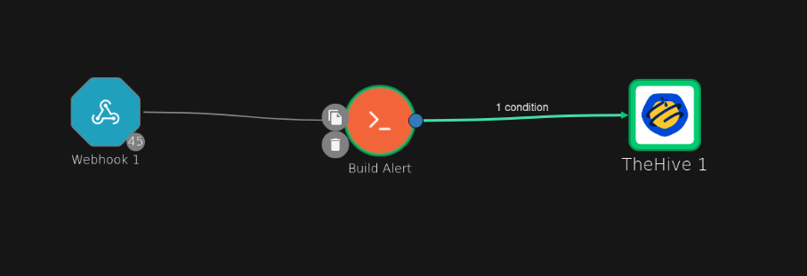
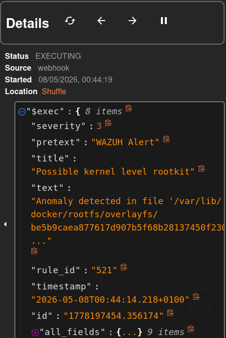
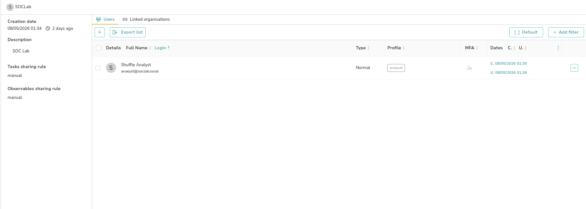
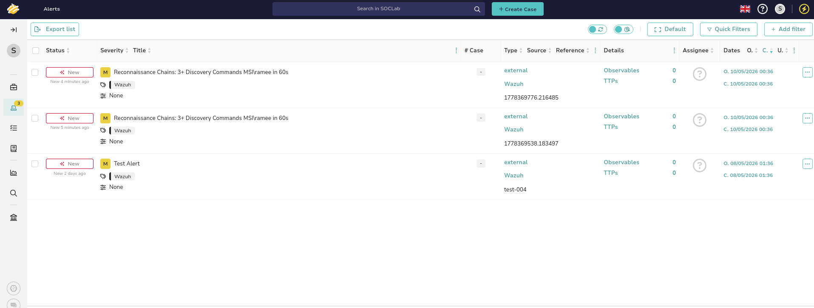
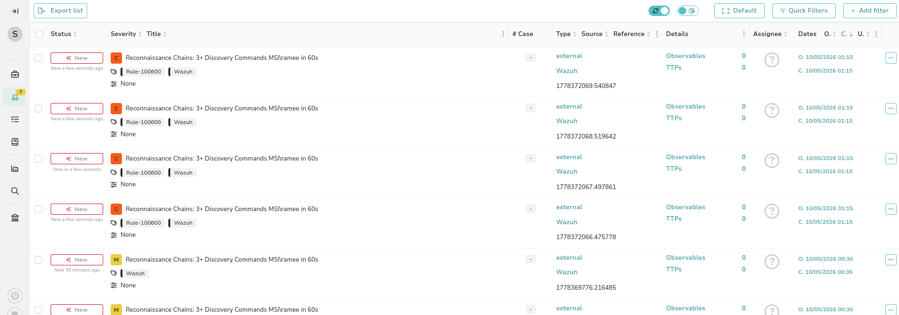
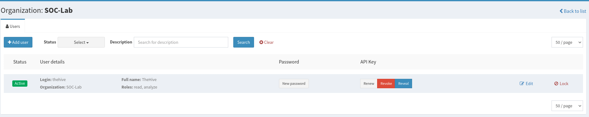
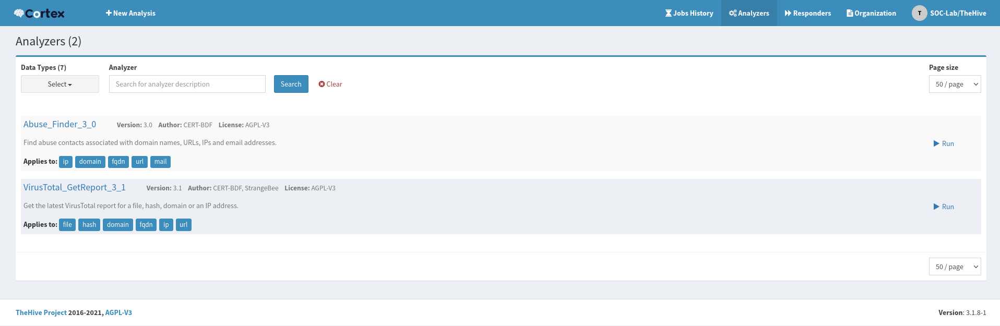
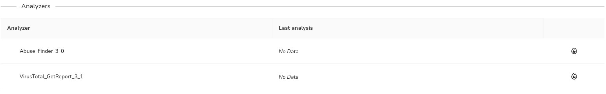
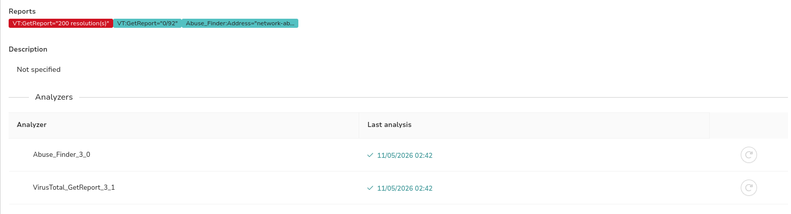

# Phase 6 — SOAR: Wazuh → Shuffle → TheHive

## Tổng quan

Detection mà không có response là chưa hoàn chỉnh. Phase 6 kết nối Wazuh vào một SOAR pipeline đầy đủ — mỗi high-fidelity alert tự động tạo một case-ready alert trong TheHive, được enrich bằng rule context và severity, sẵn sàng để analyst triage.

Phase 6 cũng bổ sung victim endpoint thứ hai: một **Windows 11 laptop (MSI)** chạy Wazuh agent cùng với Windows 10 VM hiện có. Tất cả alert từ cả hai machine giờ đây đều đi qua cùng một pipeline.

---

## Architecture

```
Windows 10 / Windows 11 (MSI)
        ↓  Sysmon + Wazuh Agent
Wazuh Manager (192.168.56.10)
        ↓  Webhook integration (rule level ≥ 2 severity)
Shuffle SOAR (192.168.56.10:3001)
        ↓  Build Alert node (filter + enrich + severity map)
        ↓  Condition: skip = false
TheHive 5 (192.168.56.10:9000)
        ↓  Alert được tạo trong SOCLab org
Cortex 3 (192.168.56.10:9001)
        ↓  Analyzers: VirusTotal, Abuse_Finder
        ↓  Enrich observable bên trong case
Analyst (Kali browser)
```

---

## Vai trò của các Tool

**Wazuh** là detection engine. Nó tạo alert cho mỗi rule khớp trên tất cả agent. Mọi thứ đều được ghi log tại đây — hàng trăm event mỗi ngày trên cả hai machine. Analyst không triage tại đây; họ sử dụng Wazuh để investigation raw log trong quá trình xử lý case.

**Shuffle** là thành phần tự động kết nối các hệ thống. Nó chạy ngầm trong background. Khi Wazuh kích hoạt high-severity alert, Shuffle nhận alert qua webhook, filter noise, enrich alert và đẩy sang TheHive. Analyst không cần mở Shuffle trong công việc hằng ngày.

**TheHive** là workspace chính của analyst. Nó chỉ nhận các alert đã được curate và filter từ Shuffle. Analyst thực hiện triage tại đây, chuyển alert thành case, thêm observable và ghi chép investigation.

**Cortex** là enrichment engine. Được kết nối với TheHive, Cortex thực hiện live threat intelligence lookup (VirusTotal, Abuse_Finder) với các observable trong case chỉ bằng một cú nhấp chuột.

---

## Phần 1 — Wazuh Webhook Integration

Wazuh gửi alert đến Shuffle thông qua integration module. Mỗi alert khớp với filter sẽ kích hoạt một HTTP POST đến Shuffle webhook URL.

Cấu hình trong `/var/ossec/etc/ossec.conf` trên Wazuh manager:

```xml
<integration>
  <name>shuffle</name>
  <hook_url>http://192.168.56.10:3001/api/v1/hooks/webhook_XXXXX</hook_url>
  <level>3</level>
  <alert_format>json</alert_format>
</integration>
```

Restart manager để áp dụng:

```bash
sudo systemctl restart wazuh-manager
```

Wazuh webhook payload chứa:

| Field | Mô tả |
|---|---|
| `$exec.title` | Rule description (alert title) |
| `$exec.severity` | Wazuh severity 0–3 (được map từ rule level) |
| `$exec.rule_id` | Rule ID đã kích hoạt |
| `$exec.id` | Alert ID duy nhất (được dùng làm sourceRef để deduplication) |
| `$exec.text.win.*` | Windows event data (system + eventdata lồng nhau) |

---

## Phần 2 — Shuffle Workflow

### Workflow: Wazuh Alert đến TheHive

```
Webhook 1 → Build Alert (Python) → [condition: skip=false] → TheHive 1
```

**Webhook 1** — nhận raw Wazuh JSON payload. Mọi alert từ mọi agent đều được gửi đến đây.

**Build Alert** — Python node thực hiện:
1. Filter low-severity alert (`$exec.severity < 2` → skip)
2. Map Wazuh severity (0–3) sang TheHive severity (1–4)
3. Xây dựng enriched description string

**Condition** — chặn việc forward nếu `$build_alert.message.skip = true`

**TheHive 1** — tạo alert trong SOCLab organisation thông qua TheHive API



### Build Alert Python code

```python
import json, sys

severity_wazuh = int("$exec.severity") if "$exec.severity" != "" else 0

if severity_wazuh < 2:
    print(json.dumps({"skip": True, "severity": 1, "description": ""}))
    sys.exit(0)

thehive_severity = severity_wazuh + 1

desc = "Rule: $exec.rule_id (Wazuh Severity: " + str(severity_wazuh) + ")\n\n$exec.title"

print(json.dumps({"skip": False, "severity": thehive_severity, "description": desc}))
```

**Severity mapping:**

| Wazuh `severity` | Khoảng Wazuh level | TheHive severity | Label |
|---|---|---|---|
| 0 | 0–3 | 1 | Low |
| 1 | 4–7 | 2 | Medium |
| 2 | 8–11 | 3 | High |
| 3 | 12–15 | 4 | Critical |

### TheHive node — Advanced mode body

```json
{
  "title": "$exec.title",
  "description": "$build_alert.message.description",
  "severity": $build_alert.message.severity,
  "type": "external",
  "source": "Wazuh",
  "sourceRef": "$exec.id",
  "tags": ["Wazuh", "Rule-$exec.rule_id"]
}
```

Các điểm chính:
- `sourceRef` sử dụng `$exec.id` — TheHive deduplicate dựa trên `type:source:sourceRef`, vì vậy cùng một alert không bao giờ được tạo hai lần
- `severity` **không đặt trong dấu nháy** — Shuffle phải thay thế nó bằng integer, không phải string
- Tag bao gồm rule ID — hiển thị ngay trong danh sách alert của TheHive mà không cần mở alert

### Webhook execution — dữ liệu Shuffle nhận được



---

## Phần 3 — Thiết lập TheHive

### Organisation: SOCLab

TheHive sử dụng organisation để giới hạn phạm vi dữ liệu. Tất cả lab alert được đưa vào organisation `SOCLab`, tách biệt với default admin org.

Tạo thông qua API:

```bash
curl -s -u admin@thehive.local:secret \
  -X POST "http://localhost:9000/api/v1/organisation" \
  -H "Content-Type: application/json" \
  -d '{"name":"SOCLab","description":"SOC Lab"}'
```

### Analyst user

User `analyst@soclab.local` nhận tất cả alert do Shuffle tạo. Đây là account Shuffle sử dụng để authentication.

```bash
# Create analyst user
curl -s -H "Authorization: Bearer <admin-api-key>" \
  -X POST "http://localhost:9000/api/v1/user" \
  -H "Content-Type: application/json" \
  -d '{
    "login": "analyst@soclab.local",
    "name": "Shuffle Analyst",
    "profile": "analyst",
    "organisation": "SOCLab"
  }'

# Set API key for Shuffle authentication
curl -s -H "Authorization: Bearer <admin-api-key>" \
  -X POST "http://localhost:9000/api/v1/user/analyst@soclab.local/key/renew"
```

Analyst profile bao gồm permission `manageAlert` — bắt buộc để Shuffle tạo alert thông qua API.



---

## Phần 4 — Alert được truyền vào TheHive

Khi pipeline đang chạy, mỗi reconnaissance chain detection trên MSI laptop sẽ tự động xuất hiện trong TheHive dưới dạng alert mới — đã được tag, severity-mapped và có source là Wazuh.





Sự khác biệt giữa alert cũ và mới có thể thấy rõ:
- **Cũ** (trước enrichment): Medium severity, chỉ có Wazuh tag
- **Mới** (sau enrichment): Critical severity, tag `Rule-100600` + `Wazuh`, sourceRef duy nhất cho mỗi alert

---

## Phần 5 — Cortex Enrichment

### Thiết lập

Cortex chạy trên `192.168.56.10:9001`. TheHive kết nối với Cortex bằng API key được cấu hình trong `/etc/thehive/application.conf`:

```hocon
cortex {
  servers = [
    {
      name = local
      url = "http://127.0.0.1:9001"
      auth {
        type = "bearer"
        key = "<thehive-user-api-key-from-cortex>"
      }
    }
  ]
}
```

Service user `thehive` trong organisation SOC-Lab của Cortex có role `read` + `analyze` — đủ để submit job và retrieve result.



### Các Analyzer được bật

Analyzer catalog được load từ `https://download.thehive-project.org/analyzers.json`. Tất cả analyzer chạy dưới dạng Docker container — không cần cài đặt Python cục bộ.

| Analyzer | Data types | Mục đích | Yêu cầu API key |
|---|---|---|---|
| Abuse_Finder_3_0 | ip, domain, fqdn, url, mail | Tìm abuse contact cho IP và domain | Không |
| VirusTotal_GetReport_3_1 | file, hash, domain, fqdn, ip, url | Reputation lookup trên hơn 90 AV engine | Có (free tier) |



### Chạy analyzer từ một case

1. Mở TheHive alert → **+ Create Case**
2. Trong case, đi đến **Observables** → **+** → thêm type `ip`, value `<suspicious IP>`
3. Nhấp vào observable → cuộn đến **Analyzers** → nhấp run (flame icon)
4. Kết quả xuất hiện dưới dạng tagged report badge trên observable



### Kết quả Analyzer

Chạy cả hai analyzer với `8.8.8.8` (test IP):

- `VT:GetReport="200 resolution(s)"` — VirusTotal tìm thấy 200 DNS resolution cho IP này
- `VT:GetReport="0/92"` — 0 trong số 92 AV engine đánh dấu IP này (clean)
- `Abuse_Finder:Address="network-ab..."` — trả về abuse contact cho IP block



---

## Phần 6 — Kiểm thử End-to-End

**Attack:** Chạy hơn 7 recon command trên Windows 11 (MSI) trong vòng 60 giây

```cmd
whoami && net user && ipconfig /all && netstat -ano && net localgroup administrators && arp -a && systeminfo
```

**Detection:** Wazuh rule 100600 kích hoạt (hơn 3 discovery command bởi cùng một user trong 60 giây)

**Automation:**
1. Wazuh POST alert đến Shuffle webhook
2. Build Alert node map Wazuh severity 3 → TheHive severity 4 (Critical)
3. Condition được thông qua (`skip=false`)
4. TheHive API trả về 201 Created
5. Alert xuất hiện trong SOCLab org sau vài giây

**Triage:**
1. Analyst đăng nhập TheHive bằng `analyst@soclab.local`
2. Critical alert mới hiển thị trong Alerts queue
3. Analyst mở alert → chuyển thành case
4. Thêm suspicious IP dưới dạng observable
5. Chạy VirusTotal + Abuse_Finder chỉ bằng một cú nhấp chuột
6. Ghi chép finding và đóng case

---

## Tham chiếu cấu hình Wazuh Integration

```xml
<!-- /var/ossec/etc/ossec.conf -->
<integration>
  <name>shuffle</name>
  <hook_url>http://192.168.56.10:3001/api/v1/hooks/webhook_XXXXX</hook_url>
  <level>3</level>
  <alert_format>json</alert_format>
</integration>
```

```bash
# Verify Wazuh is sending to Shuffle
sudo tail -f /var/ossec/logs/integrations.log
```

## Service Endpoints

| Service | Port | URL |
|---|---|---|
| Wazuh Dashboard | 443 | `https://192.168.56.10` |
| TheHive | 9000 | `http://192.168.56.10:9000` |
| Cortex | 9001 | `http://192.168.56.10:9001` |
| Shuffle | 3001 | `http://192.168.56.10:3001` |

## Các bài học chính

**Variable substitution trong Shuffle** — numeric field (severity) phải không có dấu nháy trong TheHive JSON body. `"severity": "$var"` gửi string; `"severity": $var` gửi integer. TheHive API từ chối string cho integer field với lỗi 400 BadRequest.

**Shuffle output paths** — Output của Python node được lồng bên dưới `message`. `$build_alert.severity` không tồn tại; `$build_alert.message.severity` mới tồn tại. Cả condition và TheHive node đều cần full path.

**TheHive org permissions** — Platform admin (`admin@thehive.local`) không có permission `manageAlert`. Shuffle phải authentication bằng một user có profile `analyst` trong target organisation. Platform admin chỉ dành cho platform management.

**Docker Swarm và plain Docker cho Shuffle** — Orborus (Shuffle execution engine) mặc định sử dụng Docker Swarm mode. Trong single-node lab, Swarm gây ra worker container failure. Đặt `SHUFFLE_SWARM_CONFIG=` (trống) trong Orborus environment để tắt Swarm và sử dụng plain `docker run` — worker sẽ thực thi ổn định.

**Memory pressure** — Ubuntu VM chạy đồng thời Wazuh OpenSearch, Cortex Elasticsearch, Cassandra, TheHive, Cortex và Shuffle OpenSearch. Tất cả đều là JVM process. TheHive cần 3–5 phút để bind hoàn toàn vào port 9000 sau khi restart do Pekko cluster initialisation. Kiểm tra bằng `sudo ss -tlnp | grep 9000` trước khi cho rằng service đã down.
